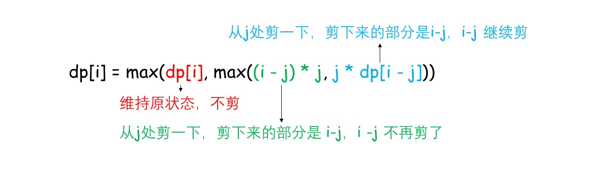

## 题目链接

[https://leetcode-cn.com/problems/jian-sheng-zi-lcof/](https://leetcode-cn.com/problems/jian-sheng-zi-lcof/)

## 题目描述

给你一根长度为 n 的绳子，请把绳子剪成整数长度的 m 段（m、n都是整数，n>1并且m>1），每段绳子的长度记为 `k[0],k[1]...k[m-1]` 。请问 `k[0]*k[1]*...*k[m-1]` 可能的最大乘积是多少？例如，当绳子的长度是8时，我们把它剪成长度分别为2、3、3的三段，此时得到的最大乘积是18。

示例 1：

```
输入: 2
输出: 1
解释: 2 = 1 + 1, 1 × 1 = 1
```

示例 2:

```
输入: 10
输出: 36
解释: 10 = 3 + 3 + 4, 3 × 3 × 4 = 36
```

提示：

- 2 <= n <= 58

## 题解

动态规划：

- 状态定义：dp[i] = 长度为 i 时的最大乘积；
- 状态转移方程：`dp[i] = max(dp[i], max((i - j) * j, j * dp[i - j]))` ，可以这样理解：


时间复杂度：O(N^2)

空间复杂度：O(N)

贪心：

**核心思路是：尽可能把绳子分成长度为3的小段，这样乘积最大。**

证明可参考：[https://leetcode-cn.com/problems/jian-sheng-zi-lcof/solution/mian-shi-ti-14-i-jian-sheng-zi-tan-xin-si-xiang-by/](https://leetcode-cn.com/problems/jian-sheng-zi-lcof/solution/mian-shi-ti-14-i-jian-sheng-zi-tan-xin-si-xiang-by/)

步骤如下：

1. 如果 n == 2，返回 1，如果 n == 3，返回 2，两个可以合并成 n 小于 4 的时候返回 n - 1
2. 如果 n == 4，返回 4
3. 如果 n > 4，分成尽可能多的长度为 3 的小段，每次循环长度 n 减去 3，乘积 res 乘以 3；最后返回时乘以小于等于 4 的最后一小段
4. 以上 2 和 3 可以合并

时间复杂度：O(N)

空间复杂度：O(1)

## 提交

### 动态规划

```java
class Solution {
    public int cuttingRope(int n) {
        int[] dp = new int[n + 1];
        dp[2] = 1;
        for (int i = 3; i <= n; i++) {
            for (int j = 0; j < i; j++) {
                dp[i] = Math.max(dp[i], Math.max(j * (i - j), j * dp[i - j]));
            }
        }
        return dp[n];
    }
}
```

### 贪心

```java
class Solution {
    public int cuttingRope(int n) {
        if(n < 4){
            return n - 1;
        }
        int res = 1;
        while(n > 4){
            res *= 3;
            n -= 3;
        }
        return res * n;
    }
}
```