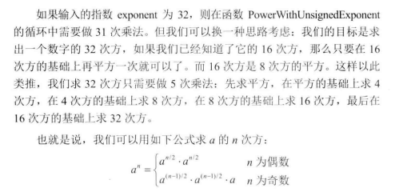

## 题目链接

[https://leetcode-cn.com/problems/shu-zhi-de-zheng-shu-ci-fang-lcof/](https://leetcode-cn.com/problems/shu-zhi-de-zheng-shu-ci-fang-lcof/)

## 题目描述

实现函数double Power(double base, int exponent)，求base的exponent次方。不得使用库函数，同时不需要考虑大数问题。

示例 1:

```
输入: 2.00000, 10
输出: 1024.00000
```

示例 2:

```
输入: 2.10000, 3
输出: 9.26100
```

示例 3:

```
输入: 2.00000, -2
输出: 0.25000
解释: 2-2 = 1/22 = 1/4 = 0.25
```

说明:

- -100.0 < x < 100.0

- n 是 32 位有符号整数，其数值范围是 [−231, 231 − 1] 。

## 题解



时间复杂度：O(logN)

空间复杂度：O(N)

## 提交

```java
class Solution {
    public double myPow(double x, int n) {
        long N = n;
        if (N < 0) {
            return 1 / myPow(x, -N);
        }
        return myPow(x, N);
    }

    private double myPow(double x, long n) {
        if (n == 0) {
            return 1;
        }
        if (x == 1) {
            return 1;
        }
        // 根据指数是奇数还是偶数进行分类讨论
        if ((n % 2) == 0) {
            // 分治思想：分
            double square = myPow(x, n / 2);
            // 分治思想：合，下面同理
            return square * square;
        } else {
            // 是奇数的时候
            double square = myPow(x, (n - 1) / 2);
            return square * square * x;
        }
    }
}
```