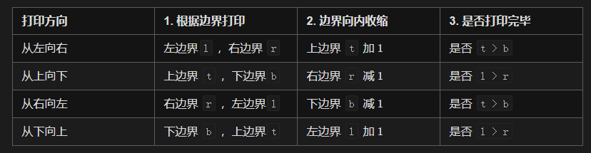

## 题目链接

[https://leetcode-cn.com/problems/shun-shi-zhen-da-yin-ju-zhen-lcof/](https://leetcode-cn.com/problems/shun-shi-zhen-da-yin-ju-zhen-lcof/)

## 题目描述

输入一个矩阵，按照从外向里以顺时针的顺序依次打印出每一个数字。

示例 1：

```
输入：matrix = [[1,2,3],[4,5,6],[7,8,9]]
输出：[1,2,3,6,9,8,7,4,5]
```

示例 2：

```
输入：matrix = [[1,2,3,4],[5,6,7,8],[9,10,11,12]]
输出：[1,2,3,4,8,12,11,10,9,5,6,7]
```

限制：

- 0 <= matrix.length <= 100

- 0 <= matrix[i].length <= 100

## 题解

可以发现，顺时针打印矩阵的顺序是 “从左向右、从上向下、从右向左、从下向上” 循环。

因此，考虑设定矩阵的“左、上、右、下”四个边界，模拟以上矩阵遍历顺序。



时间复杂度：O(MN)

空间复杂度：O(1)

## 提交

```java
class Solution {
    public int[] spiralOrder(int[][] matrix) {
        if (matrix == null || matrix.length == 0) {
            return new int[0];
        }
        int t = 0, b = matrix.length - 1, l = 0, r = matrix[0].length - 1;
        int[] res = new int[(b + 1) * (r + 1)];
        int x = 0;
        while (true) {
            for (int i = l; i <= r; i++) {
                res[x++] = matrix[t][i];
            }
            if (++t > b) {
                break;
            }
            for (int i = t; i <= b; i++) {
                res[x++] = matrix[i][r];
            }
            if (l > --r) {
                break;
            }
            for (int i = r; i >= l; i--) {
                res[x++] = matrix[b][i];
            }
            if (t > --b) {
                break;
            }
            for (int i = b; i >= t; i--) {
                res[x++] = matrix[i][l];
            }
            if (++l > r) {
                break;
            }
        }
        return res;
    }
}
```