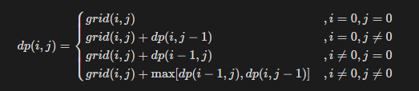

## 题目链接

[https://leetcode-cn.com/problems/li-wu-de-zui-da-jie-zhi-lcof/](https://leetcode-cn.com/problems/li-wu-de-zui-da-jie-zhi-lcof/)

## 题目描述

在一个 m*n 的棋盘的每一格都放有一个礼物，每个礼物都有一定的价值（价值大于 0）。你可以从棋盘的左上角开始拿格子里的礼物，并每次向右或者向下移动一格、直到到达棋盘的右下角。给定一个棋盘及其上面的礼物的价值，请计算你最多能拿到多少价值的礼物？

示例 1:

```
输入: 
[
  [1,3,1],
  [1,5,1],
  [4,2,1]
]
输出: 12
解释: 路径 1→3→5→2→1 可以拿到最多价值的礼物
```

提示：

- 0 < grid.length <= 200

- 0 < grid[0].length <= 200

## 题解

状态定义： 设动态规划矩阵 dp ，dp(i,j) 代表从棋盘的左上角开始，到达单元格 (i,j) 时能拿到礼物的最大累计价值。

转移方程：
1. 当 i = 0 且 j = 0 时，为起始元素；
2. 当 i = 0 且 j /= 0 时，为矩阵第一行元素，只可从左边到达；
3. 当 i /= 0 且 j=0 时，为矩阵第一列元素，只可从上边到达；
4. 当 i /= 0 且 j /= 0 时，可从左边或上边到达；



初始状态： dp[0][0] = grid[0][0]，即到达单元格 (0,0) 时能拿到礼物的最大累计价值为 grid[0][0] ；

返回值： dp[m-1][n-1] ，m, n 分别为矩阵的行高和列宽，即返回 dp 矩阵右下角元素。

时间复杂度：O(MN)

空间复杂度：O(MN)

## 提交

```java
class Solution {
    public int maxValue(int[][] grid) {
        if (grid == null || grid.length == 0) {
            return 0;
        }
        int m = grid.length;
        int n = grid[0].length;
        int[][] dp = new int[m][n];
        dp[0][0] = grid[0][0];
        for (int i = 1; i < m; i++) {
            dp[i][0] = dp[i - 1][0] + grid[i][0];
        }
        for (int j = 1; j < n; j++) {
            dp[0][j] = dp[0][j - 1] + grid[0][j];
        }
        for (int i = 1; i < m; i++) {
            for (int j = 1; j < n; j++) {
                dp[i][j] = Math.max(dp[i - 1][j], dp[i][j - 1]) + grid[i][j];
            }
        }
        return dp[m - 1][n - 1];
    }
}
```