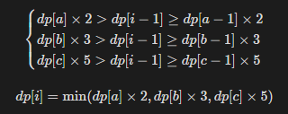

## 题目链接

[https://leetcode-cn.com/problems/chou-shu-lcof/](https://leetcode-cn.com/problems/chou-shu-lcof/)

## 题目描述

我们把只包含质因子 2、3 和 5 的数称作丑数（Ugly Number）。求按从小到大的顺序的第 n 个丑数。

示例:

```
输入: n = 10
输出: 12
解释: 1, 2, 3, 4, 5, 6, 8, 9, 10, 12 是前 10 个丑数。
```

说明:  

1. 1 是丑数。

2. n 不超过1690。

## 题解

状态定义： 设动态规划列表 dp ，dp[i] 代表第 i + 1 个丑数；

转移方程：
1. 当索引 a, b, c 满足以下条件时， dp[i] 为三种情况的最小值；
2. 每轮计算 dp[i] 后，需要更新索引 a, b, c 的值，使其始终满足方程条件。实现方法：分别独立判断 dp[i] 和 dp[a] × 2 , dp[b] × 3 , dp[c] × 5 的大小关系，若相等则将对应索引 a , b , c 加 1 ；
  


初始状态： dp[0] = 1 ，即第一个丑数为 1 ；

返回值： dp[n-1] ，即返回第 n 个丑数；

时间复杂度：O(N)

空间复杂度：O(N)

## 提交

```java
class Solution {
    public int nthUglyNumber(int n) {
        int a = 0, b = 0, c = 0;
        int[] dp = new int[n];
        dp[0] = 1;
        for(int i = 1; i < n; i++) {
            int n2 = dp[a] * 2, n3 = dp[b] * 3, n5 = dp[c] * 5;
            dp[i] = Math.min(Math.min(n2, n3), n5);
            if(dp[i] == n2) a++;
            if(dp[i] == n3) b++;
            if(dp[i] == n5) c++;
        }
        return dp[n - 1];
    }
}
```