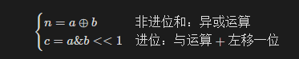

## 题目链接

[https://leetcode-cn.com/problems/bu-yong-jia-jian-cheng-chu-zuo-jia-fa-lcof/](https://leetcode-cn.com/problems/bu-yong-jia-jian-cheng-chu-zuo-jia-fa-lcof/)

## 题目描述

写一个函数，求两个整数之和，要求在函数体内不得使用 “+”、“-”、“*”、“/” 四则运算符号。

示例:

```
输入: a = 1, b = 1
输出: 2
```

提示：

- a, b 均可能是负数或 0

- 结果不会溢出 32 位整数

## 题解

https://leetcode-cn.com/problems/bu-yong-jia-jian-cheng-chu-zuo-jia-fa-lcof/solution/mian-shi-ti-65-bu-yong-jia-jian-cheng-chu-zuo-ji-7/

无进位和与异或运算规律相同，进位和与运算规律相同（并需左移一位）。因此，无进位和 n 与进位 c 的计算公式如下；



（和 s）=（非进位和 n）+（进位 c）。即可将 s = a + b 转化为：`s=a+b⇒s=n+c`

循环求 n 和 c ，直至进位 c = 0；此时 s = n，返回 n 即可。

时间复杂度: O(1)

空间复杂度: O(1)


## 提交

```java
class Solution {
    public int add(int a, int b) {
        while(b != 0) { // 当进位为 0 时跳出
            int c = (a & b) << 1;  // c = 进位
            a ^= b; // a = 非进位和
            b = c; // b = 进位
        }
        return a;
    }
}
```