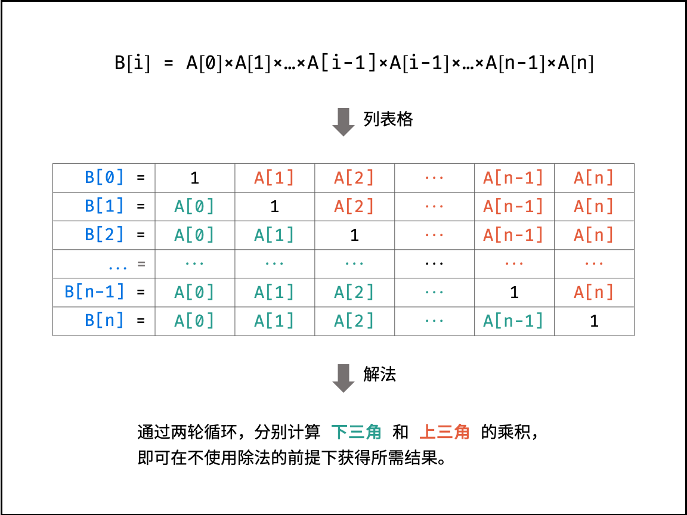

## 题目链接

[https://leetcode-cn.com/problems/gou-jian-cheng-ji-shu-zu-lcof/](https://leetcode-cn.com/problems/gou-jian-cheng-ji-shu-zu-lcof/)

## 题目描述

给定一个数组 A[0,1,…,n-1]，请构建一个数组 B[0,1,…,n-1]，其中 B 中的元素 B[i]=A[0]×A[1]×…×A[i-1]×A[i+1]×…×A[n-1]。不能使用除法。

示例:

```
输入: [1,2,3,4,5]
输出: [120,60,40,30,24]
```

提示：

- 所有元素乘积之和不会溢出 32 位整数

- a.length <= 100000

## 题解

根据题目对 B[i] 的定义，可列表格，如下图所示。

根据表格的主对角线（全为 1 ），可将表格分为上三角和下三角两部分。分别迭代计算下三角和上三角两部分的乘积，即可不使用除法就获得结果。



时间复杂度: O(N)

空间复杂度: O(1)

## 提交

```java
class Solution {
    public int[] constructArr(int[] a) {
        int len = a.length;
        if (len == 0) {
            return new int[0];
        }
        int[] b = new int[len];
        b[0] = 1;
        int tmp = 1;
        for (int i = 1; i < len; i++) {
            b[i] = b[i - 1] * a[i - 1];
        }
        for (int i = len - 2; i >= 0; i--) {
            tmp *= a[i + 1];
            b[i] *= tmp;
        }
        return b;
    }
}
```